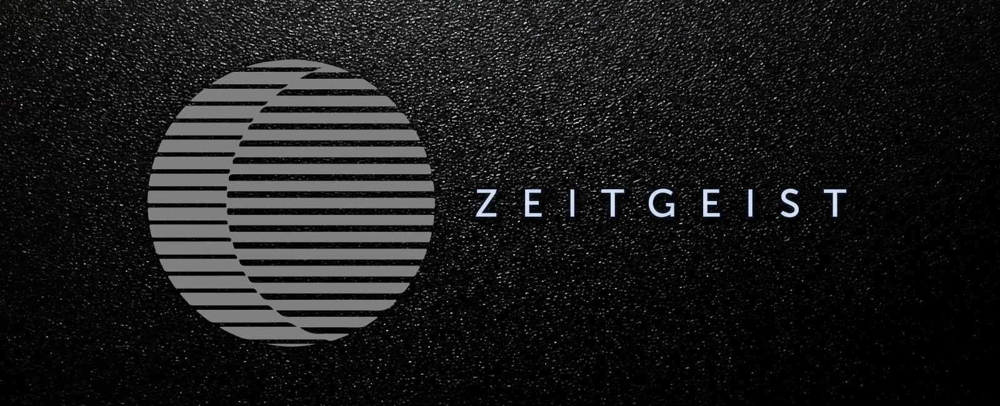

<a href="https://zeitgeist.pm">
  
</a>

# Zeitgeist: An Evolving Blockchain for Prediction Markets and Futarchy

 [](https://codecov.io/gh/zeitgeistpm/zeitgeist) [](https://discord.gg/MD3TbH3ctv) [](https://t.me/zeitgeist_official)

Zeitgeist is a decentralized network for creating, betting on, and resolving
prediction markets. The platform's native currency, the ZTG, is used to sway the
direction of the network, and as a means of last-call dispute resolution.
Additionally, Zeitgeist is a protocol for efficient trading of prediction market
shares and will one day become the backbone of the decentralized finance
ecosystem by allowing traders to create complex financial contracts on
virtually _anything_.

## Modules

- [authorized](./zrml/authorized) - Offers authorized resolution of disputes.
- [court](./zrml/court) - An implementation of a court mechanism used to resolve
  disputes in a decentralized fashion.
- [global-disputes](./zrml-global-disputes) - Global disputes sets one out of
  multiple outcomes with the most locked ZTG tokens as the canonical outcome.
  This is the default process if a dispute mechanism fails to resolve.
- [liquidity-mining](./zrml/liquidity-mining) - This pallet implements the
  time-based incentivization with Zeitgeist tokens for continuously providing
  liquidity to swap pools.
- [market-commons](./zrml/market-commons) - Contains common operations on
  markets that are used by multiple pallets.
- [orderbook-v1](./zrml/orderbook-v1) - A naive orderbook implementation that's
  only part of Zeitgeist's PoC. Will be replaced by a v2 orderbook that uses
  0x-style hybrid on-chain and off-chain trading.
- [prediction-markets](./zrml/prediction-markets) - The core implementation of
  the prediction market logic for creating and resolving markets.
- [simple-disputes](./zrml-simple-disputes) - Simple disputes selects the last
  dispute after a predetermined amount of disputes as the canonical outcome.
- [swaps](./zrml/swaps) - An implementation of liquidity pools that allows any
  user to provide liquidity to the pool or swap assets in and out of the pool.
  The market maker that is traded against is either a Constant Function Market
  Maker (CFMM) or a Rikiddo Market Maker.
- [primitives](./zrml/primitives) - Contains custom and common types, traits and
  constants.
- [rikiddo](./zrml/rikiddo) - The module contains a completely modular
  implementation of our novel market scoring rule [Rikiddo][rikiddo]. It also
  offers a pallet, that other pallets can use to utilize the Rikiddo market
  scoring rule. Rikiddo can be used by the automated market maker to determine
  swap prices.

## How to build and run a Zeitgeist node

Zeitgeist node comes in two flavors, one for standalone self-contained execution
and another for Kusama/Polkadot parachain integration.

To build the standalone version, simply point to the top directory of this
project and type:

```bash
cargo build --release
```

To build the parachain version, execute the following command:

```
cargo build --features parachain --release
```

Optimized binaries (`--release`) are usually used for production (faster and
smaller), but this behavior is optional and up to you.

Our current beta test network [Battery Station][zg-beta] runs as a parachain. To
connect your Zeitgeist parachain node, follow the tutorial at our [documentation
site][bs-docs].

Alternatively you can run a non-parachain node, which is usually only necessary
for testing purposes, by executing the following command:

```
cargo run --release --bin zeitgeist -- <node-options-and-flags>
```

A common value for `<node-options-and-flags>` is `--dev --tmp`, which runs a
local temporary development node.

### Using Docker

We publish the latest standalone and parachain version to the [Docker
Hub][zg-docker-hub], from where it can be pulled and ran locally to connect to
the network with relatively low effort and high compatibility. In order to fetch
the latest docker image, ensure you have Docker installed locally, then type (or
paste) the following commands in your terminal.

For parachain Zeitgeist node:

```
docker pull zeitgeistpm/zeitgeist-node-parachain
```

For standalone, non-parachain Zeitgeist node:

```
docker pull zeitgeistpm/zeitgeist-node
```

Our current beta test network [Battery Station][zg-beta] runs as a parachain. To
connect your Zeitgeist parachain node, follow the tutorial at our [documentation
site][bs-docs].

Alternatively you can run a non-parachain node, which is usually only necessary
for testing purposes, by executing the following command:

```
docker run zeitgeistpm/zeitgeist-node -- <node-options-and-flags>
```

[bs-docs]: https://docs.zeitgeist.pm/docs/basic/battery-station
[ls-lmsr]: https://www.eecs.harvard.edu/cs286r/courses/fall12/papers/OPRS10.pdf
[rikiddo]:
  https://blog.zeitgeist.pm/introducing-zeitgeists-rikiddo-scoring-rule/
[zg-beta]: https://blog.zeitgeist.pm/zeitgeist-beta/
[zg-docker-hub]: https://hub.docker.com/r/zeitgeistpm/zeitgeist-node
